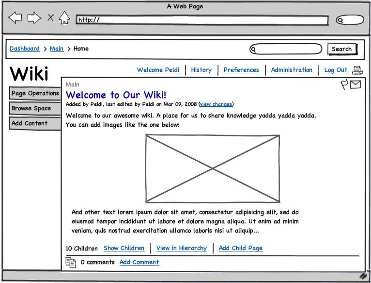

# Frontend developer assignment

## Intro
We are excited to have you here! Below you will find few tasks for frontend developer position. Time in parenthesis for each task indicates optimal time you should be spending on each of them. Please push your changes to the exiting branch 'feedback'.
 
When you have completed the tasks, please assign pull request to Håkon (@HakonBJohansen) and also send an e-mail to ([recruitment@getadigital.com](mailto:recruitment@getadigital.com)).
 
Ps. We are working on improving the tasks. If you have any questions or feedback, please let us know!
 
 
We wish you good luck!

## Task 1 - Design (30 minutes)
Take a look at the picture below and come up with suggestions on how this design could adapt to different devices (mobile, tablets etc). Things we're looking for is how the layout should change and look for mobile users, basic UX things to keep in mind and other best practices when developing responsive websites.

## Task 2 - API consumption (1 hour)
Choose any public API (http://www.programmableweb.com/apis/directory is a good resource for finding one). Just use frontend code to get the data from the API and present it on a static HTML page (in a semantic way). Try and keep it simple and use native HTML, CSS and JavaScript without adding any external libraries and frameworks like Angular, React, Bootstrap and similar.

## Wrapping Up
We hope You enjoyed implementing these tasks.
If you could have more time on each of the tasks - can you enlist what kind of changes, improvements or refactorings you would make in your task implementations?
Have any questions or suggestions? Don't hesitate to contact us!
 
 
Hope to see you soon!
 
-- Geta Hiring Team
